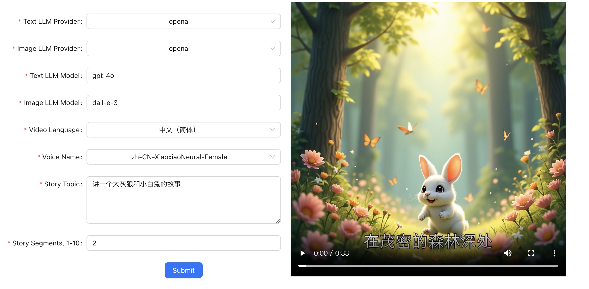

[English](./README.md) | 简体中文


## 项目说明

本项目可以输入一个故事主题，使用大语言模型生成故事视频，视频中包含大模型生成的图片、故事内容，以及音频和字幕信息。

项目后端技术栈为 python + fastapi 框架，前端为 react + antd + vite。


## 视频演示

<table>
<thead>
<tr>
<th align="center"><g-emoji class="g-emoji" alias="arrow_forward">▶️</g-emoji> 《兔子和小狐狸的故事》</th>
<th align="center"><g-emoji class="g-emoji" alias="arrow_forward">▶️</g-emoji> 《大灰狼和小白兔的故事》</th>
</tr>
</thead>
<tbody>
<tr>
<td align="center"><video src="https://github.com/user-attachments/assets/e1893b9c-83ed-420c-a29a-1f5f878117c4"></video></td>
<td align="center"><video src="https://github.com/user-attachments/assets/8868e1b5-a931-4d25-9762-859a4c32d4f4"></video></td>
</tr>
</tbody>
</table>

## 界面截图




## 使用说明

1. 下载本项目

```
git clone https://github.com/alecm20/story-flicks.git
```

2. 设置模型信息

```
# 先切换到项目根目录
cp .env.example .env


text_provider="openai"    # 文本生成模型的提供商，目前支持 openai和 aliyun、deepseek，阿里云文档：https://www.aliyun.com/product/bailian
image_provider="aliyun"   # 图片生成模型的提供商，目前只支持 openai和 aliyun

openai_base_url="https://api.openai.com/v1" # openai 的 baseUrl
aliyun_base_url="https://dashscope.aliyuncs.com/compatible-mode/v1" # 阿里云的 baseUrl
deepseek_base_url="https://api.deepseek.com/v1" # deepseek 的 baseUrl
ollama_base_url="http://localhost:11434/v1" # ollama 的 baseUrl

openai_api_key= # openai 的 api key，可以只填一个
aliyun_api_key= # 阿里云百炼的 api key，可以只填一个
deepseek_api_key= # deepseek 的 api key，目前该 api_key 只支持文本生成
ollama_api_key= # 如果需要使用的话，请填写ollama，目前该 api_key 只支持文本生成，并且不能用参数量太小的模型，推荐qwen2.5:14b 或者更大的模型。

text_llm_model=gpt-4o # 如果 text_provider 设置为 openai，这里只能填 OpenAI 的模型，如：gpt-4o。如果设置了 aliyun，可以填阿里云的大模型，如：qwen-plus 或者 qwen-max。ollama 的模型不能使用体积太小的模型，否则无法输出正确的 json，可以使用如：qwen2.5:14b 或更大的模型。

image_llm_model=flux-dev # 如果 image_provider 设置为 openai，这里只能填 OpenAI 的模型，如：dall-e-3。如果设置了 aliyun，可以填阿里云的大模型，阿里云推荐使用：flux-dev，目前可以免费试用，具体参考：https://help.aliyun.com/zh/model-studio/getting-started/models#a1a9f05a675m4。


```

3. 启动后端项目

```
# 先切换到项目根目录
cd backend
conda create -n story-flicks python=3.10 # 这里使用 conda，其他的虚拟环境创建方式也可以
conda activate story-flicks
pip install -r requirements.txt
uvicorn main:app --reload

```
如果项目成功，会有如下信息输出：

```
INFO:     Uvicorn running on http://127.0.0.1:8000 (Press CTRL+C to quit)
INFO:     Started reloader process [78259] using StatReload
INFO:     Started server process [78261]
INFO:     Waiting for application startup.
INFO:     Application startup complete.
```

4. 启动前端项目

```
# 先切换到项目根目录
cd frontend
npm install
npm run dev

#启动成功之后打开：http://localhost:5173/
```
启动成功会输出如下信息:

```
  VITE v6.0.7  ready in 199 ms

  ➜  Local:   http://localhost:5173/
  ➜  Network: use --host to expose
  ➜  press h + enter to show help
```

5. 开始使用

根据界面中的字段，选择文本生成模型提供商、图片生成模型提供商、文本模型、图片生成模型、视频语言、声音、故事主题、故事段落，然后点击生成，即可生成视频。根据填写的段落数量，生成图片，一个段落生成一张图片，设置的段落越多，生成视频的耗时也会更久。如果成功之后，视频会展示在前端页面中。
